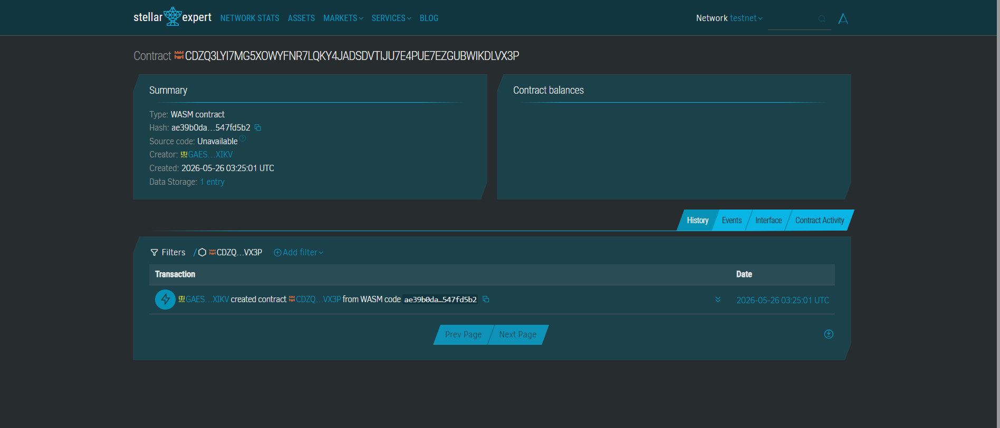

# SumakayAkoSaJeepney 🚌

> *"Sumakay ako sa jeepney"* — Tagalog for "I rode the jeepney."

**Contactless XLM fare payments for jeepney commuters in the City of San Fernando, Pampanga.**

## Demo Screenshot



---

## Problem

Jeepney drivers in the City of San Fernando, Pampanga lose time and passengers during busy hours because commuters often do not carry exact fare, causing delays while drivers search for change and pass payments across crowded jeepneys.

## Solution

Passengers scan a Stellar QR code displayed inside the jeepney and instantly transfer XLM directly to the driver's wallet with near-zero fees and immediate on-chain payment confirmation — no cash, no change, no delay.

---

## Stellar Features Used

| Feature | Purpose |
|---|---|
| **XLM transfers** | Native micropayments for fares (as low as ₱13) |
| **Soroban smart contracts** | On-chain fare recording, driver stats, receipt retrieval |
| **Events** | Real-time payment notification to driver's mobile device |

---

## Architecture

```
Passenger scans QR
        │
        ▼
  Frontend dApp (mobile browser)
        │  pay_fare(passenger, amount, route)
        ▼
  Soroban Contract (Stellar Testnet)
        │  stores FarePayment record
        │  emits fare_paid event
        ▼
  Driver mobile dashboard
  receives instant confirmation
```

---

## Vision & Purpose

San Fernando is a busy commerce hub in Central Luzon, with dozens of jeepney routes running all day. The exact-change problem is not unique to this city — it affects every jeepney route in the Philippines. SumakayAkoSaJeepney proves that Stellar's sub-second finality and near-zero fees make blockchain-based micropayments viable for the lowest-income daily transactions: a ₱13 jeepney fare.

By deploying on Stellar, drivers gain:
- A tamper-proof daily earnings ledger
- Instant payment confirmation (no disputed change)
- A path toward formal financial identity and credit history

---

## Timeline

| Phase | Description |
|---|---|
| Day 1 | Contract development & unit tests |
| Day 2 | Frontend QR scanner + payment flow |
| Day 3 | Testnet deployment & demo polish |

---

## Prerequisites

- [Rust](https://www.rust-lang.org/tools/install) (stable, 1.74+)
- [Soroban CLI](https://soroban.stellar.org/docs/getting-started/setup) v21.x
  ```bash
  cargo install --locked soroban-cli --features opt
  ```
- A funded Stellar **testnet** account (use [Stellar Friendbot](https://friendbot.stellar.org))

---

## Build

```bash
cd contracts
soroban contract build
# Output: target/wasm32-unknown-unknown/release/sumakay_ako_sa_jeepney.wasm
```

---

## Test

```bash
cd contracts
cargo test --features testutils
```

Expected output:
```
running 5 tests
test tests::test_pay_fare_happy_path ... ok
test tests::test_pay_fare_zero_amount_rejected ... ok
test tests::test_state_after_multiple_payments ... ok
test tests::test_get_payment_record_correct ... ok
test tests::test_double_initialization_rejected ... ok

test result: ok. 5 passed; 0 failed
```

---

## Deploy to Testnet

### 1. Configure Soroban CLI

```bash
soroban network add \
  --rpc-url https://soroban-testnet.stellar.org \
  --network-passphrase "Test SDF Network ; September 2015" \
  testnet

soroban keys generate --network testnet driver_wallet
soroban keys fund driver_wallet --network testnet
```

### 2. Deploy the contract

```bash
soroban contract deploy \
  --wasm target/wasm32-unknown-unknown/release/sumakay_ako_sa_jeepney.wasm \
  --source driver_wallet \
  --network testnet
# Returns: CONTRACT_ID (save this)
```

### 3. Initialize with the driver's address

```bash
export CONTRACT_ID=<your_contract_id>
export DRIVER_ADDRESS=$(soroban keys address driver_wallet)

soroban contract invoke \
  --id $CONTRACT_ID \
  --source driver_wallet \
  --network testnet \
  -- initialize \
  --driver $DRIVER_ADDRESS
```

---

## Sample CLI Invocations

### Pay a fare (MVP function)

```bash
# Passenger pays 0.13 XLM (1,300,000 stroops) for the SM–Dolores route
soroban contract invoke \
  --id $CONTRACT_ID \
  --source passenger_wallet \
  --network testnet \
  -- pay_fare \
  --passenger $(soroban keys address passenger_wallet) \
  --amount 1300000 \
  --route "SM Pampanga-Dolores"
```

### Check driver stats

```bash
soroban contract invoke \
  --id $CONTRACT_ID \
  --source driver_wallet \
  --network testnet \
  -- get_stats
# Returns: {"passenger_count":1,"total_collected":1300000}
```

### Retrieve a specific payment receipt

```bash
soroban contract invoke \
  --id $CONTRACT_ID \
  --source driver_wallet \
  --network testnet \
  -- get_payment \
  --index 0
```

---

## Project Structure

```
sumakay-ako-sa-jeepney/
├── contracts/
│   ├── Cargo.toml
│   └── src/
│       ├── lib.rs      ← Soroban contract
│       └── test.rs     ← 5 unit tests
├── frontend/
│   └── index.html      ← Mobile-first passenger dApp
└── README.md
```

---

## Deployment Information

### Contract ID

```text
CDZQ3LYI7MG5XOWYFNR7LQKY4JADSDVTIJU7E4PUE7EZGUBWIKDLVX3P
```

### Stellar Testnet Explorer

https://stellar.expert/explorer/testnet/contract/CDZQ3LYI7MG5XOWYFNR7LQKY4JADSDVTIJU7E4PUE7EZGUBWIKDLVX3P

---

## License

MIT © 2026 SumakayAkoSaJeepney Contributors